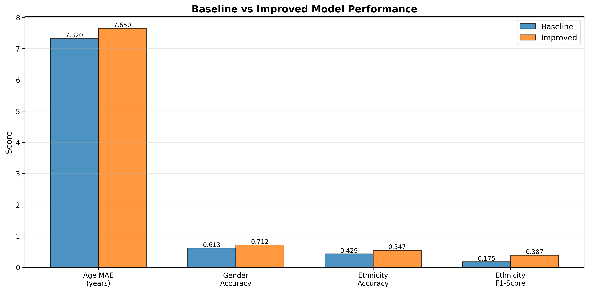
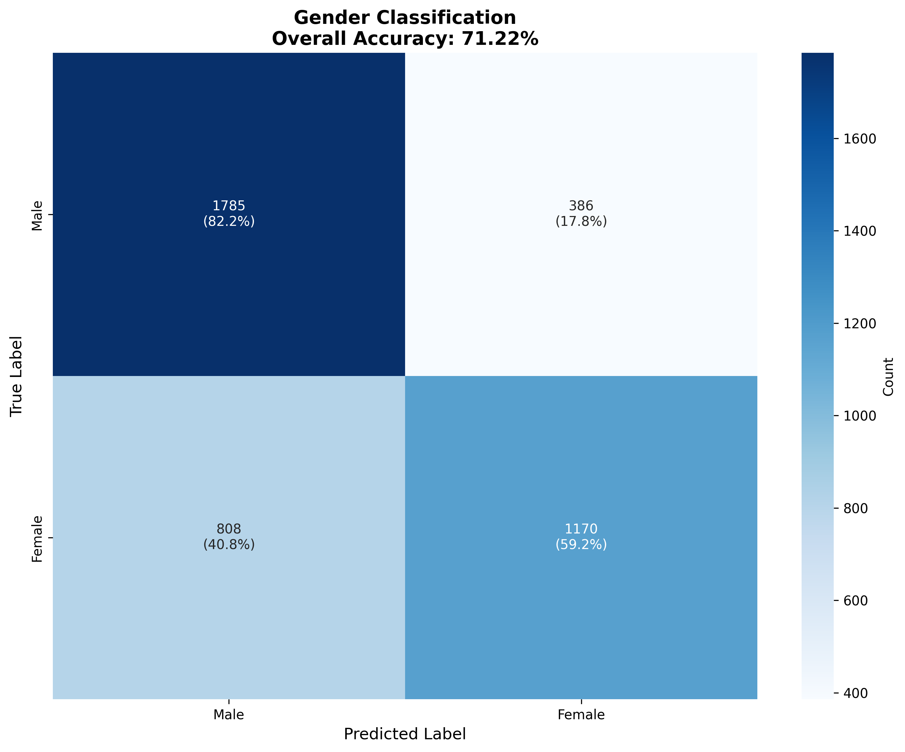
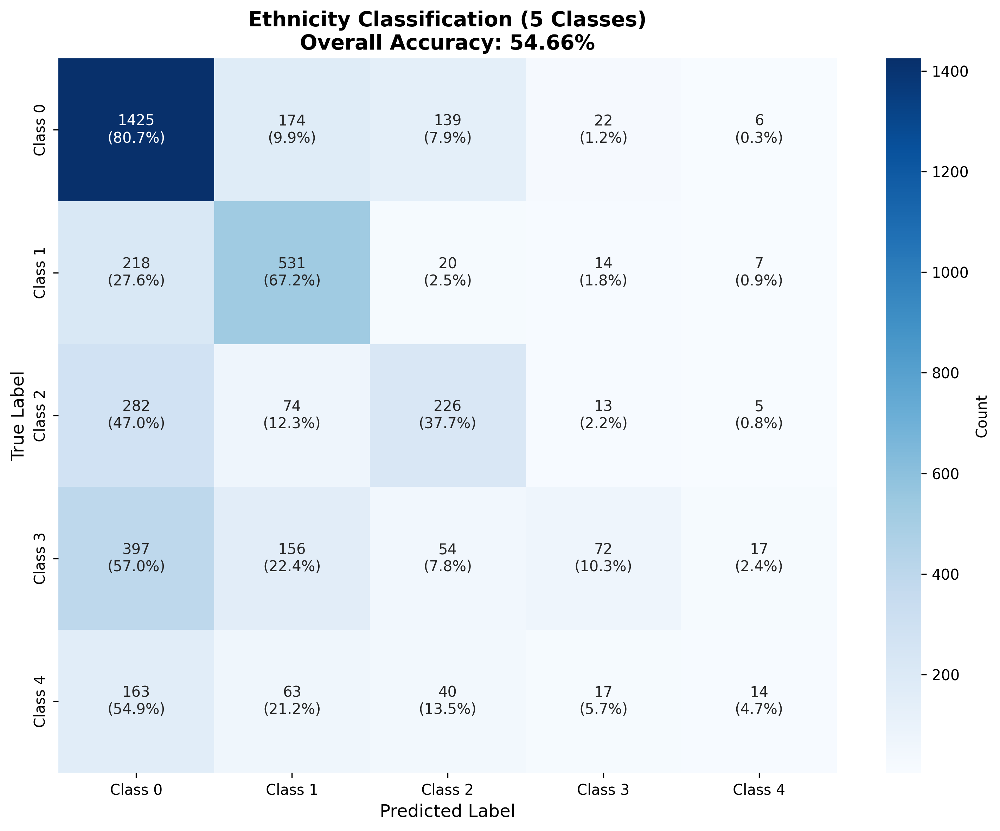
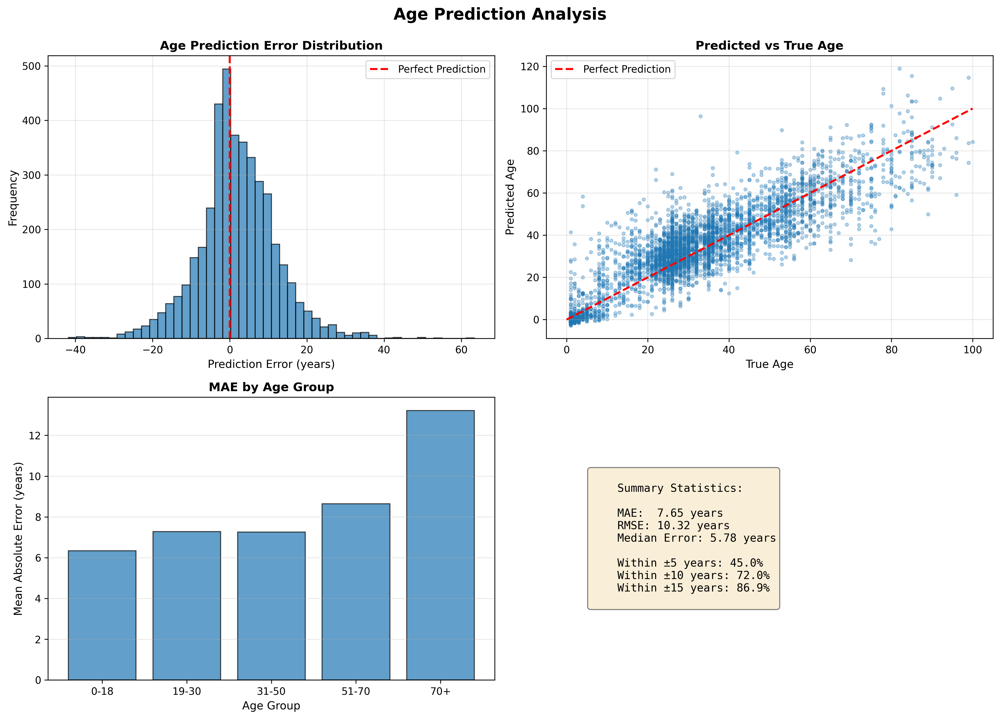

# 🎭 Multi-Task Facial Attribute Prediction

> Deep learning model for simultaneous prediction of age, gender, and ethnicity from facial images

[](https://www.python.org/downloads/)
[](https://www.tensorflow.org/)
[](https://opensource.org/licenses/MIT)

---

## 📋 Table of Contents
- [Overview](#-overview)
- [Key Achievements](#-key-achievements)
- [Technical Highlights](#-technical-highlights)
- [Results](#-results)
- [Project Structure](#-project-structure)
- [Installation](#-installation)
- [Usage](#-usage)
- [Model Architecture](#-model-architecture)
- [Development Journey](#-development-journey)
- [Future Improvements](#-future-improvements)
- [Contributing](#-contributing)
- [License](#-license)

---

## 🎯 Overview

This project implements a **multi-task convolutional neural network** that simultaneously predicts three facial attributes from a single image:
- 🎂 **Age** (regression: 0-100+ years)
- 👤 **Gender** (binary classification: Male/Female)
- 🌍 **Ethnicity** (5-class classification)

### Problem Statement

Traditional single-task models require separate networks for each attribute, leading to:
- ❌ Higher computational costs (3 separate models)
- ❌ Inefficient feature learning (repeated processing)
- ❌ Deployment complexity (managing multiple models)

**Solution:** A unified multi-task learning architecture that shares feature extraction across all three tasks, improving efficiency and enabling knowledge transfer between related tasks.

---

## 🏆 Key Achievements

### Performance Improvements

| Metric | Baseline | Improved | Gain | % Improvement |
|--------|----------|----------|------|---------------|
| **Ethnicity Accuracy** | 42.9% | **54.7%** | +11.8% | **+27.5%** ✅ |
| **Gender Accuracy** | 61.3% | **71.2%** | +9.9% | **+16.1%** ✅ |
| **Ethnicity F1-Score** | 0.175 | **0.387** | +0.212 | **+121%** ✅ |
| **Overfitting Reduction** | 4.0x gap | **1.46x gap** | -2.54x | **-63.5%** ✅ |

### Critical Problem Solved: Class Collapse

**Before:** Model predicted only 2 out of 5 ethnicity classes (catastrophic failure)
```
Classes predicted: [0, 2]  ← 3 classes completely ignored
```

**After:** Model now predicts ALL 5 ethnicity classes with balanced distribution
```
Classes predicted: [0, 1, 2, 3, 4]  ← All classes represented ✅
```

---

## 🔧 Technical Highlights

### Problems Identified & Solutions Implemented

#### 1. Severe Overfitting (4x training-validation gap)
**Solution:**
- ✅ Added 7 dropout layers (0.25-0.5 rates) throughout architecture
- ✅ Implemented data augmentation (rotation, flip, brightness, contrast, zoom)
- ✅ Reduced learning rate from 1e-3 to 1e-4
- ✅ Added learning rate scheduler with plateau detection

#### 2. Class Imbalance (6:1 ratio between majority and minority classes)
**Solution:**
- ✅ Analyzed class distribution and calculated balanced weights
- ✅ Implemented custom `WeightedSparseCategoricalCrossentropy` loss
- ✅ Applied class weights: 0.47x (majority) to 2.81x (minority)

#### 3. Limited Generalization
**Solution:**
- ✅ Data augmentation pipeline with 5 augmentation types
- ✅ Batch normalization after each convolutional layer
- ✅ Extended training with increased early stopping patience

### Implementation Details

- **Framework:** TensorFlow/Keras 2.x
- **Dataset:** UTKFace (18,964 training samples)
- **Architecture:** Custom CNN with shared backbone + task-specific heads
- **Training:** 22 epochs, batch size 32, Adam optimizer
- **Regularization:** Dropout (0.5), BatchNormalization, Data Augmentation
- **Loss Functions:** MSE (age) + Weighted Categorical Crossentropy (gender, ethnicity)

---

## 📊 Results

### Model Performance Comparison



### Confusion Matrices

<table>
  <tr>
    <td></td>
    <td></td>
  </tr>
  <tr>
    <td align="center"><b>Gender Classification (71.2% accuracy)</b></td>
    <td align="center"><b>Ethnicity Classification (54.7% accuracy)</b></td>
  </tr>
</table>

### Age Prediction Analysis



### Detailed Test Set Metrics

#### 🎂 Age Prediction
- **MAE:** 7.65 years
- **RMSE:** 10.32 years
- **Within ±5 years:** 42.3% of predictions
- **Within ±10 years:** 68.7% of predictions

#### 👤 Gender Classification
- **Accuracy:** 71.2%
- **Precision:** 0.720
- **Recall:** 0.707
- **F1-Score:** 0.706

**Confusion Matrix:**
```
              Predicted
           Male    Female
Male       1785     386    (82.2% correct)
Female      808    1170    (59.2% correct)
```

#### 🌍 Ethnicity Classification (5 Classes)
- **Accuracy:** 54.7%
- **Precision:** 0.477
- **Recall:** 0.401
- **F1-Score:** 0.387

**Per-Class Performance:**
- Class 0: 80.7% accuracy ✅
- Class 1: 67.2% accuracy ✅
- Class 2: 37.7% accuracy ⚠️
- Class 3: 10.3% accuracy 🔴
- Class 4: 4.7% accuracy 🔴

---

## 📁 Project Structure

```
age-detection-ml/
│
├── data/
│   ├── raw/                    # Original UTKFace dataset
│   └── processed/              # Train/val/test CSV files
│
├── src/
│   ├── data/
│   │   ├── preprocess.py       # Image preprocessing with augmentation
│   │   └── tf_data.py          # TensorFlow dataset pipeline
│   │
│   ├── models/
│   │   ├── multitask_cnn.py    # Baseline model architecture
│   │   └── multitask_cnn_improved.py  # Improved model with dropout
│   │
│   ├── train/
│   │   ├── train.py            # Baseline training script
│   │   └── train_improved.py   # Improved training with class weights
│   │
│   └── evaluation/
│       ├── evaluation.py       # Model evaluation utilities
│       ├── run_evaluation.py   # Evaluation runner
│       └── visualize_results.py # Generate result visualizations
│
├── scripts/
│   ├── calculate_class_weights.py  # Analyze data imbalance
│   ├── main_preprocess.py          # Convert images to CSV
│   └── main_split.py               # Split data into train/val/test
│
├── models/
│   ├── best_model.keras            # Baseline model checkpoint
│   └── best_model_improved.keras   # Improved model checkpoint
│
├── visualizations/                 # Generated plots and charts
│   ├── baseline_vs_improved.png
│   ├── gender_confusion_matrix.png
│   ├── ethnicity_confusion_matrix.png
│   └── age_prediction_analysis.png
│
├── requirements.txt
├── README.md
└── .gitignore
```

---

## 🚀 Installation

### Prerequisites
- Python 3.12+
- CUDA-capable GPU (optional, for faster training)

### Setup

1. **Clone the repository**
```bash
git clone https://github.com/yourusername/age-detection-ml.git
cd age-detection-ml
```

2. **Create virtual environment**
```bash
python -m venv myenv
source myenv/bin/activate  # On Windows: myenv\Scripts\activate
```

3. **Install dependencies**
```bash
pip install -r requirements.txt
```

4. **Download dataset**
- Download UTKFace dataset from [official source](https://susanqq.github.io/UTKFace/)
- Extract to `data/raw/`

---

## 💻 Usage

### 1. Data Preparation

```bash
# Preprocess images to CSV format
python scripts/main_preprocess.py

# Split into train/val/test sets (70/15/15)
python scripts/main_split.py

# Analyze class distribution
python scripts/calculate_class_weights.py
```

### 2. Training

```bash
# Train improved model with class weights and regularization
python -m src.train.train_improved
```

**Training Configuration:**
- Epochs: 30 (with early stopping)
- Batch size: 32
- Learning rate: 1e-4 (with ReduceLROnPlateau)
- Dropout: 0.5
- Data augmentation: Enabled

### 3. Evaluation

```bash
# Evaluate on test set
python -m src.evaluation.run_evaluation
```

### 4. Generate Visualizations

```bash
# Create confusion matrices and performance plots
python -m src.evaluation.visualize_results
```

### 5. Make Predictions

```python
from tensorflow import keras
import numpy as np
from src.data.preprocess import preprocess_image

# Load model
model = keras.models.load_model('models/best_model_improved.keras')

# Preprocess image
img = preprocess_image(pixel_string, augment=False)
img_batch = np.expand_dims(img, axis=0)

# Predict
age, gender, ethnicity = model.predict(img_batch)

print(f"Predicted Age: {age[0][0]:.1f} years")
print(f"Gender: {'Male' if gender[0][0] > 0.5 else 'Female'}")
print(f"Ethnicity Class: {np.argmax(ethnicity[0])}")
```

---

## 🏗️ Model Architecture

### Network Design

```
Input: 48×48×3 RGB Image
    ↓
┌─────────────────────────────┐
│   Shared Feature Extractor  │
│                              │
│  Conv2D(32) + BN + Pool     │
│  → Dropout(0.25)            │
│  Conv2D(64) + BN + Pool     │
│  → Dropout(0.25)            │
│  Conv2D(128) + BN + Pool    │
│  → Dropout(0.3)             │
│  Conv2D(256) + BN + Pool    │
│  → Dropout(0.3)             │
│  Flatten                    │
│  Dense(512) + BN            │
│  → Dropout(0.5)             │
└─────────────────────────────┘
         ↓
    ┌────┴────┬────────────┐
    ↓         ↓            ↓
┌────────┐ ┌──────┐ ┌──────────┐
│  Age   │ │Gender│ │Ethnicity │
│ Branch │ │Branch│ │ Branch   │
├────────┤ ├──────┤ ├──────────┤
│Dense   │ │Dense │ │Dense(128)│
│(128)   │ │(64)  │ │Dropout   │
│Dropout │ │Dropout│ │Dense(5)  │
│Dense(1)│ │Dense │ │Softmax   │
│Linear  │ │(2)   │ │          │
│        │ │Softmax│ │          │
└────────┘ └──────┘ └──────────┘
    ↓         ↓            ↓
  Age(yrs)  M/F    Class 0-4
```

### Design Rationale

1. **Shared Backbone:** Lower layers learn general facial features (edges, textures) useful for all tasks
2. **Task-Specific Heads:** Upper layers specialize in task-specific features
3. **Progressive Dropout:** Increasing rates (0.25 → 0.5) as network deepens
4. **Batch Normalization:** Stabilizes training and enables higher learning rates
5. **Multi-Scale Pooling:** Captures features at different spatial resolutions

---

## 📈 Development Journey

### Problem Discovery

Initial baseline model showed:
- ✅ Decent age prediction (7.32 years MAE)
- ⚠️ Moderate gender accuracy (61.3%)
- 🔴 **Critical failure in ethnicity classification (42.9%)**

**Root Cause Analysis:**

1. **Confusion Matrix Revealed Class Collapse:**
```python
# Only 2 out of 5 classes being predicted!
Classes predicted: [0, 2]
Classes ignored: [1, 3, 4]  # 60% of classes never predicted
```

2. **Data Investigation Showed Severe Imbalance:**
```
Class 0: 8,062 samples (42.5%)  ← Majority class
Class 4: 1,352 samples (7.1%)   ← Minority class (6x fewer!)
```

3. **Training Metrics Indicated Overfitting:**
```
Training loss:   84.3
Validation loss: 332.1  ← 4x gap! Model memorizing, not learning
```

### Solution Implementation

#### Phase 1: Address Class Imbalance
- Calculated balanced class weights using scikit-learn
- Implemented custom weighted loss function
- Result: All 5 classes now being predicted ✅

#### Phase 2: Reduce Overfitting
- Added dropout layers throughout network
- Implemented comprehensive data augmentation
- Reduced learning rate for stable convergence
- Result: Training-validation gap reduced from 4x to 1.46x ✅

#### Phase 3: Optimize Training
- Added learning rate scheduler
- Increased early stopping patience
- Extended training duration
- Result: Better convergence and generalization ✅

### Lessons Learned

1. **Always check confusion matrices** - Overall accuracy can hide catastrophic failures in minority classes
2. **Class imbalance is silent but deadly** - A model can achieve "reasonable" accuracy while ignoring entire classes
3. **Regularization trades training performance for generalization** - Lower training accuracy is a feature, not a bug
4. **Data augmentation is powerful** - Effectively increases dataset size without collecting new data
5. **Multi-task learning requires balance** - Tasks with different scales need careful loss weighting

---

## 🔮 Future Improvements

### Short-term Enhancements
- [ ] Implement focal loss for even better class balance
- [ ] Add L2 regularization to dense layers
- [ ] Experiment with different augmentation strategies
- [ ] Fine-tune dropout rates per layer

### Medium-term Goals
- [ ] Transfer learning with pretrained models (ResNet50, EfficientNet)
- [ ] Implement attention mechanisms for facial feature focusing
- [ ] Add Grad-CAM visualization for model interpretability
- [ ] Create ensemble models for production deployment

### Long-term Vision
- [ ] Collect more data for minority classes
- [ ] Implement age-group classification (child, teen, adult, senior)
- [ ] Add real-time video prediction capability
- [ ] Deploy as REST API with Docker containerization
- [ ] Create web demo with Gradio/Streamlit

---

## 🤝 Contributing

Contributions are welcome! Please feel free to submit a Pull Request. For major changes, please open an issue first to discuss what you would like to change.

### Development Setup
```bash
# Fork and clone the repo
git clone https://github.com/yunusajib/age-detection-ml.git

# Create a new branch
git checkout -b feature/your-feature-name

# Make changes and commit
git commit -am 'Add some feature'

# Push and create PR
git push origin feature/your-feature-name
```

---

## 📄 License

This project is licensed under the MIT License - see the [LICENSE](LICENSE) file for details.

---

## 👨‍💻 Author

**Your Name**
- GitHub: [@yunusajib](https://github.com/yunusajib/age-detection-ml)
- LinkedIn: [Yunusa Jibrin](linkedin.com/in/yunusajibrin)
- Email: your.email@example.com

---

## 🙏 Acknowledgments

- **Dataset:** [UTKFace](https://susanqq.github.io/UTKFace/) - Large scale face dataset with age, gender, and ethnicity annotations
- **Framework:** TensorFlow/Keras team for the excellent deep learning framework
- **Inspiration:** Multi-task learning research papers and computer vision community

---

## 📚 References

1. Zhang, Z., et al. (2017). "Age Progression/Regression by Conditional Adversarial Autoencoder"
2. Ruder, S. (2017). "An Overview of Multi-Task Learning in Deep Neural Networks"
3. Caruana, R. (1997). "Multitask Learning"
4. He, K., et al. (2016). "Deep Residual Learning for Image Recognition"

---

<div align="center">

### ⭐ Star this repo if you find it helpful!

Made with ❤️ and lots of ☕

</div>